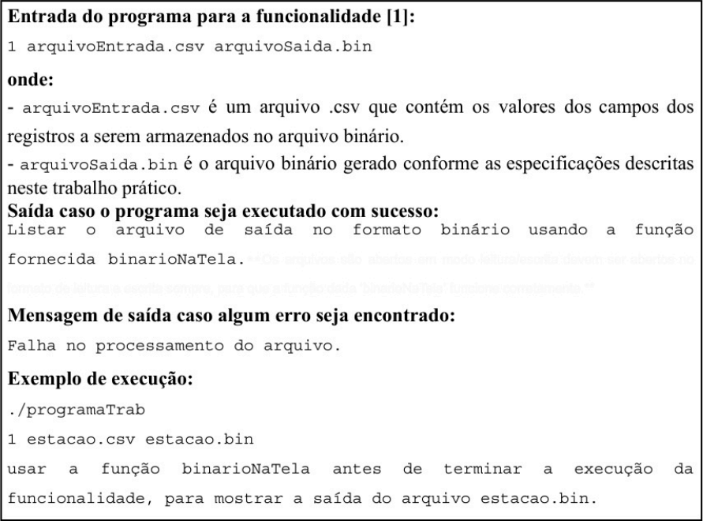
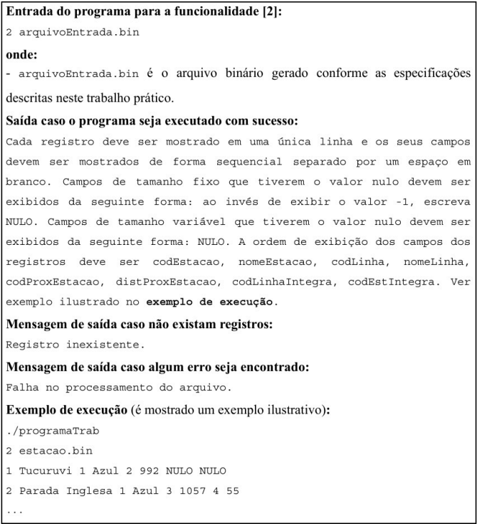
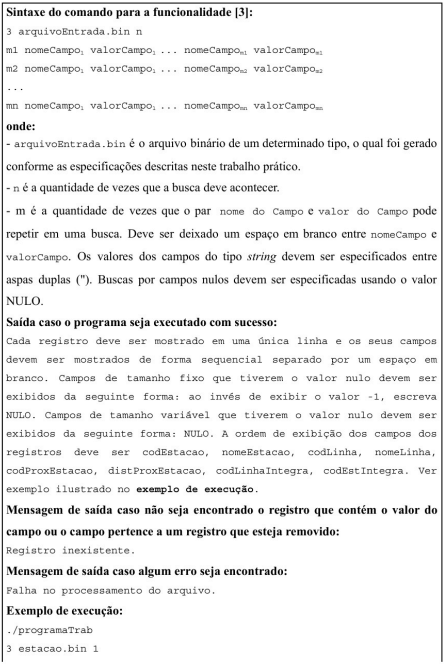
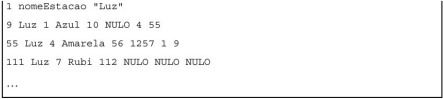
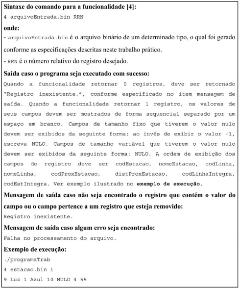

# Registro de Cabeçalho

### Deve conter:
 - **status** : Usamos para se caso houver alguma queda de energia, podemos por meio desse, saber a concistencia do arquivo. 0 = Inconcistente / 1 = Concistente. **(Quando abrirmos para escrita seu status deve estar "0" e ao finalizar deve estar "1")**
 - **topo** : armazena o byteoffset do registro logicamente removido, se não houver estará como "-1". **(Tamanho: inteiro = 4 bytes!)**
 - **proxRRN** : Armazena o valor do próximo RRN disponível (RRN+1), deve ser iniciado com 0 **(Tamanh: inteiro = 4 bytes!)**
 - **nroEstacoes** : Indica a quantidade de estações diferentes que são armazenadas no arquivo de dado. Note que se houver 2 ou mais estações com mesmo nome elas são as mesmas **(Tamanho : inteiro = 4 bytes!)**
 - **nroParesEstacoes** : Indica a quantidade de pares (codEstacao, codProxEstacao) diferentes que estão armazenadas nos arquivos de dados. **(Tamanho : inteiro = 4 bytes!)** ❓

## Cabeçalho Graficamente (17 bytes totais)
```

    0    | 1  2  3  4  | 5  6  7  8  | 9  10  11  12 | 13   14   15   16| 4x4 = 16 + 1 = 17
 ________ _____________ _____________ _______________ __________________
|        |             |             |               |                  |
| Status |    topo     |   proxRRN   |  nroEstacoes  | nroParesEstacoes |
|________|_____________|_____________|_______________|__________________|


Byte:  [0]  | [1   2   3   4] | [5   6   7   8] | [9  10  11  12] | [13  14  15  16]
Campo: Stat |      topo       |     proxRRN     |   nroEstacoes   | nroParesEstacoes
Tam:   (1B) |      (4B)       |      (4B)       |      (4B)       |       (4B)

```

**Obs. Importante!!**
- O registro de cabeçalho deve seguir estritamente essa representação gráfica!
- Os campos são de tamanho fixo, portanto os valores armazenados não devem ser finalizados com "\0"
- Não estamos considerando o conseito de pagina de disco

---

# Registro de Dados (De tamanho fixo e tamanho variado [TAMANHO VARIADO USAR INDICADOR DE TAMANHO!])

### Deve Conter:
 **TAMANHO FIXO**
  - **codEstacao** : codigo da estação **(Tamanho : inteiro - 4 bytes!)**
  - **codLinha** : codigo da linha **(Tamanho : inteiro - 4 bytes!)**
  - **codProxEstacao** : codigo da proxima estação **(Tamanho : inteiro - 4 bytes!)**
  - **distProxEstacao** : distancia para a proxima estação **(Tamanho : inteiro - 4 bytes!)**
  - **codLinhaIntegra** : codigo da linha que faz integração entre as linhas **(Tamanho : inteiro - 4 bytes!)**
  - **codEstIntegra** : codigo da estação que faz integração entre as linhas **(Tamanho : inteiro - 4 bytes!)**

 **TAMANHO VARIADO**
  - **nomeEstacao** : nome da estação
  - **nomeLinha** : nome da linha

**OS SEGUINTES CAMPOS TAMBÉM COMPÕEM CADA REGISTRO - SÃO NECESSARIOS PARA GERENCIAMENTO DE REG. LOGICAMENTE REMOVIDOS E SUPORTE NA INDICAÇÃO DE TAMANHO**

 - **removido** : indica se o registro está logicamente removido ou não. **1 = removido / 0 = não removido** **(Tamanho : String = 1 byte!)**
 - **proximo** : armazena o RRN do próximo registro logicamente removido **(Tamanho : inteiro = 4 bytes!)** - è inicializado com -1 se não tiver nenhum removido
 - **tamNomeEstação** : indica o tamanho do nome da estação **(Tamanho : inteiro = 4 bytes!)**
 - **tamNomeLinha** : indica o tamanho do nome da linha **(Tamanho : inteiro = 4 bytes!)**

**COMO ACHO QUE FICARIA INDICAÇÃO GRAFICA (JULIO):**

```
 ____________________________________________________________________________________________________________________________________________________ _________________ _______________
|                                                TAMANHO FIXO                                                                      | TAMANHO VARIADO | TAMANHO VARIADO | TAMANHO FIXO  |
| removido | proximo | codEstacao | codLinha | codProxEstacao | distProxEstacao | codLinhaIntegra | codEstIntegra | tamNomeEstacao |   Nome Estacao  |  tamNomeLinha   |   Nome Linha  |

```

**OS DADOS SÃO FORNECIDOS POR MEIO DE UM .CSV QUE TEM COMO SEPARADOR DE CAMPOS UMA "," | O TAMANHO DOS REGISTRO DE DADOS DEVE SER DE 80 BYTES**

---

## observações Importantes
 - Cada registro de dado deve seguir estritamente a ordem definida da sua representação gráfica
 - Strings de tamanho variado não podem acabar com "\0", pois são identificadas por tamanho
 - codEstacao e nomeEstacao não aceitam valores NULOS, os demais aceitam. O .csv com dados de entrada já garante essa característica
    - Para cada campo de tam fixo os valores nulos seram representados com -1
    - Pata os campos de tam variado, armazenar um valor nulo singfinica armazenar o tamanho zero no indicador de tamanho
 - Deve ser feito a diferenciação entre espaço não utilizado e lixo, sempre que houver lixo deve ser representado por "$" NUNCA PODE FICAR VAZIO, ou seja, cada byte deve armazenar um valor valido ou "$".
 - Não existe a necessidade de truncamento dos dados, o .csv já garante essa caracteristica **(COMENTARIO JULIO, GLÓRIA!)**
 - Não está sendo considerado o conceito de pagina de disco

 ---

 # Descrição Geral:
  - Faça um programa em C por meio do qual o usuário possa obter dados do arquivo de entrada .csv e gerar um arquivo binário com esses dados, bem como realizar a operação de busca nesse arquivo binário.

**Modularização:** Importante fazer se houver muita repetição de código

# Definição Específica:
  - No SQL temos o seguintes comanos, CREATE TABLE que cria tabela, ele é a representação da primeira funcionalidade que vamos implementar

# [1] - Leitura de registros
  Permite a leitura de varios registros por meio de um arquivo csv e deve-se registrar em um arquivo de saída (arquivo binário), os dados de saída do arq. binário devem seguir as específicações. ANTES DE TERMINAR A EXECUÇÃO DA FUNCIONALIDADE DEVE-SE UTILIZAR A FUNÇÃO "binarioNaTela", disponibilizada na pagina do projeto da diciplina pra mostrar a saida do binário, a função binário na tela, deve ser usado após o fechamento do arquivo e antes de terminar a execução da funcionalidade (devemos chamar ela antes de acabar a função).
  

# [2] - Recuperar dados dos registros
  - SELECT é usado para lista as colunas e FROM arquivo que contem os campos. Funcionalidade 2 representa o SELECT

  Permite a recuperação dos dados de todos os registros armazenados no arquivo de entrada, mostra os dados de forma organizada na saida padrão permitir para permitir a distinção dos campos e registros. O tratamento de lixo deve ser feito de forma a  exibir apropriada dos dados. Registros marcados como logicamente removidos não devem ser exibidos
  

# [3] - Busca por critérios
  - WHERE critário de busca, filtro pras buscar

  Permite a recuperação de dados de todos os registro de arquivo de dados de entrada de forma que esses registro satisfaçam um critério de busca determinado pela usuário. A busca deve ser feita considerando um ou mais campos. Por exemplo. é possível realizar busca considerando somente o campo codEstacao ou cosiderando os campos nomeEstacao e nomeLinha. Essa funcionalidade pode retornar 0 = nenhum registro satisfaz o critério, 1 = quando apenas um satisfaz o critério de busca, ou varios registros. os valores dos campos tipo STRING deve ser específicados entre aspas duplas ". Para manipulação de Strings com aspas duplas pode usar a função "scan_quote_string" disponibilizada na pagina do projeto. Para a busca de campos nulos, deve específicar o valor NULO. Registros logicamente removidos não devem ser exibidos, o arquivo de dados de entrada deve ser percorrido apropriadamente.
  
  
  

# [4] - 
  - O acesso por RRN(numero relativo de registro) pode ser realizado somente para registros de tamanho fixo. Um RRN fornece a posição relativa de cada registro dentro do arquivo. **byteoffset = tam*RRN**

  Permiete a recuperação de registros de um arquivo de dados a partir do RRN do registro desejado. Por exemplo, pode solicitar a recuperação dos dados do registro de RRN = 2 ou do registro de RRN = 4. Esta funcionalidade pode retornar 0 = quando nenhum satisfaz ao critério de busca ou 1 para um que satisfaz o critério de busca. Registro marcados como logicamente removidos não dever ser exibidos, o arquivo de dados de entrada deve ser percorrido apropriadamente.
  

---

# Temos algumas restrições apartir da pagina 12 do arquivo e temos que gravar o vídeo
